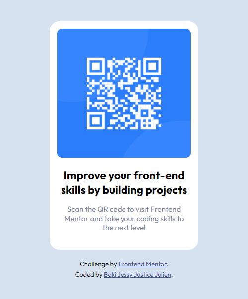
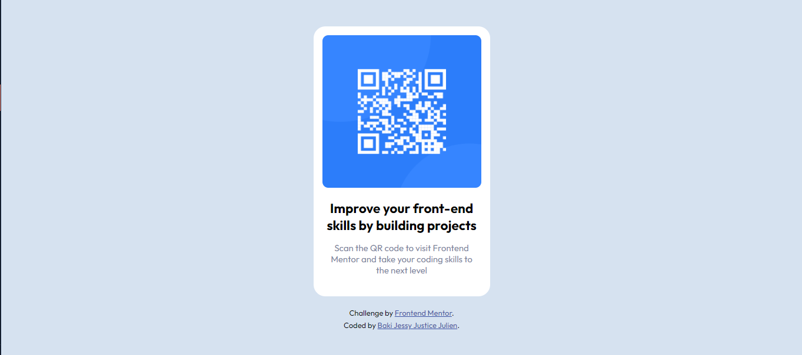

# Frontend Mentor - QR code component solution

This is my proposed solution to the [QR code component challenge on Frontend Mentor](https://www.frontendmentor.io/challenges/qr-code-component-iux_sIO_H).
Frontend Mentor challenges can help you improve your coding skills by building realistic projects.

## Table of contents

- [Overview](#overview)
  - [Screenshot](#screenshot)
  - [Links](#links)
  - [Built with](#built-with)
- [Author](#author)

## Overview

### Screenshot

### Links

- Solution URL: [Click here to check out the solution on Frontend Mentor](https://www.frontendmentor.io/solutions/qr-code-component-project-rJ9h8KLm9)
- Live Site URL: [Click here to preview the site](https://qr-code-component-page.netlify.app/)

### Built with

- Semantic HTML5 markup
- Responsive Web Design
- Vanilla CSS
- CSS custom properties
- Box Model
- FlexBox

## Author

- LinkTree - [Jessy Julien](https://www.linktr.ee/jessyjulien_)
- Frontend Mentor - [@blackdreamer15](https://www.frontendmentor.io/profile/blackdreamer15)
- Twitter - [@jessyjulien_](https://www.twitter.com/jessyjulien_)
- Linkedin - [Jessy J. J. Baki](https://www.linkedin.com/in/jessy-justice-julien-baki/)

